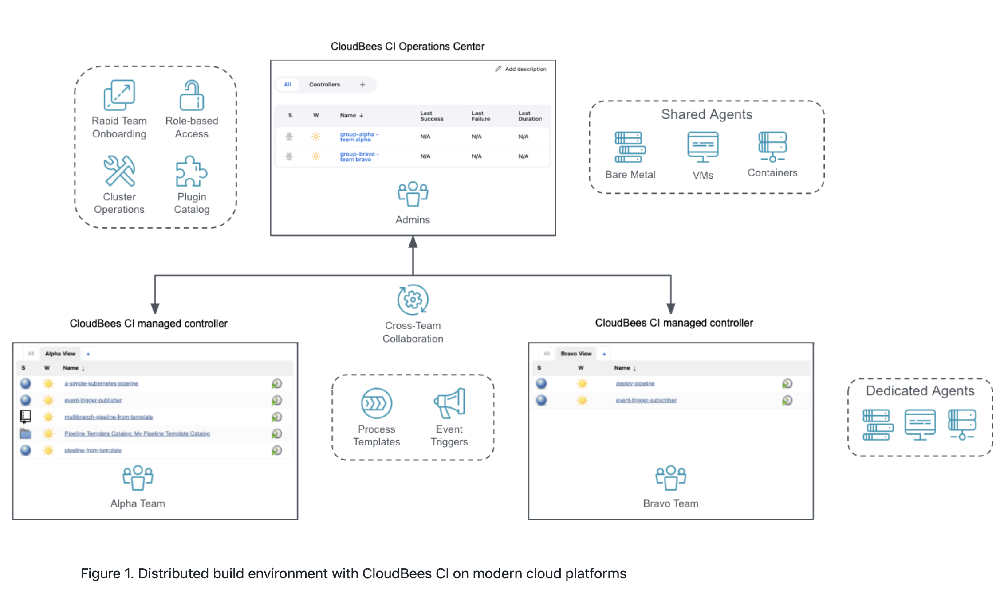
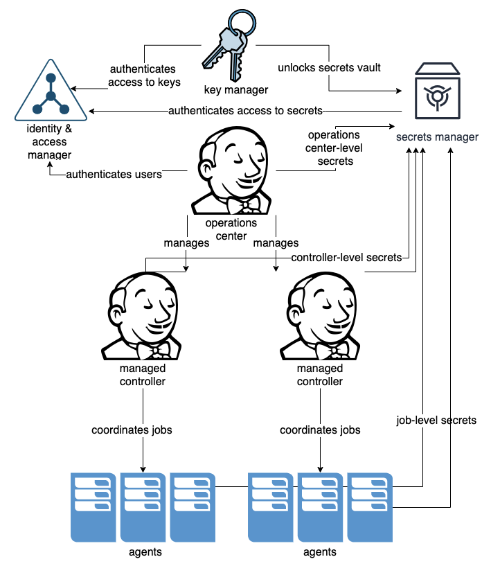
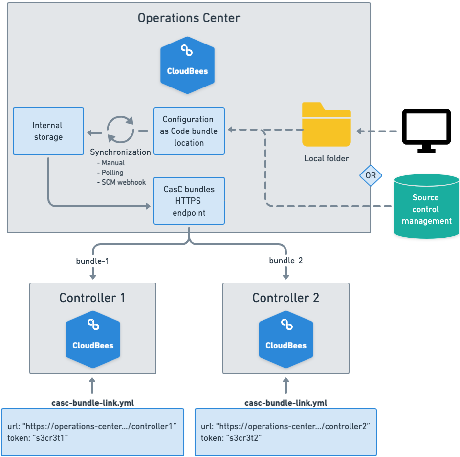

# Tech Task WP07 Jenkins aka CloudBees CI by Computacenter

## Requirements and analysis

Jenkins instance setup and security management on Kubernetes

Objective:

To set up a Jenkins instance with dummy jobs on Kubernetes, back it up, and
handle a security breach scenario using Terraform, Ansible, or similar tools.
The deployment will be done in Azure using AKS (Azure Kubernetes Service).

1. Create a Jenkins Instance with Dummy Jobs on Kubernetes
 - [X] Set up an AKS cluster in Azure.
    - [AKS setup README](aks/README.md)
 - [X] Deploy a Jenkins instance on the AKS cluster.
    - [Argo CD setup README](argocd/README.md)
    - [CloudBees setup README](cloudbees-ci/README.md)
 - [X] Create several dummy jobs in Jenkins to simulate a real environment.

2. Backup the Instance and Validate the Backup

- [X] Implement a backup strategy for the Jenkins instance.
- [X] Validate that the backup is complete and can be restored successfully.

3. Security Breach Scenario: Master Key Exposure
 - [X] Make the Instance Unavailable to Others
   - [X] Scale down the Jenkins deployment to zero replicas.
   - [X] Alternatively, remove the route to the Jenkins service or block access using a proxy.
 - [X] Rotate the Master Key
   - [X] Generate a new master key for Jenkins.
   - [X]  Update the Jenkins configuration with the new master key.
 - [X] Re-encrypt All Credentials
   - [X] Re-encrypt all stored credentials in Jenkins using the new master key.
 - [X] Make the Instance Available to Others
   - [X] Scale the Jenkins deployment back up.
   - [X] Restore the route to the Jenkins service or unblock access via the proxy.
 - [X] Validate that the Jobs are Still Working
   - [X] Ensure all dummy jobs are functioning correctly after the security changes.

## Our apporch:

Computacenter decided to pursue a solution using the enterprise version of [CloudBees CI](https://docs.cloudbees.com/docs/cloudbees-ci/latest/architecture/ci-cloud)
instead of open-source Jenkins. We are confident that this solution can fulfill
these and many other requirements more effectively, and we would like to
demonstrate this through this task. Our goal is to reduce implementation and
operational effort while increasing security by leveraging the features of an
enterprise solution.


### 1. Create a Jenkins Instance with Dummy Jobs on Kubernetes

Our approach is to provide **everything as code** and **automate** as much as possible.
For this task, we chose to set up the Azure infrastructure (AKS) using
Terraform. We decided to adopt Argo CD for the central deployment of the
[CloudBees Operations
Center](https://docs.cloudbees.com/docs/cloudbees-ci/latest/architecture/ci-cloud).
The CloudBees controllers (Jenkins instances for the teams) can be automated or
provisioned with a mouse click. However, we also wanted to take the GitOps
approach for the CloudBees Operations Center.

The following diagram illustrates the architecture and how the controllers
(Jenkins team instances) are provisioned, configured, and managed by the
CloudBees Operations Center.



Many software systems use secret data for authentication, such as user
passwords, secret keys, access tokens, and certificates. These can, of course,
be stored in a Jenkins Credentials Store. However, this means that if the
`master.key` is stolen, all credentials are directly compromised.

Our approach was to use an **Azure Key Vault** to manage important credentials that
can be accessed via an **Azure Service Principal**. This Azure Service Principal is
granted read-only rights and is accessible only from the controller. It is
stored in a Kubernetes secret an loaded during controller provisioning.

Although this was not requested in the technical task, we implemented it with
minimal effort. To meet the task requirements (even though we believe they pose
a significant security risk), we, for example, store a simple secret in the
Jenkins Credentials Store of the respective controller.

Below is an example image of this setup, which we partially implemented.



Due to time and resource constraints, and since it was not a requirement of the
technical task, we did not build this in a High Availability (active/active)
configuration. Since CloudBees supports this out-of-the-box, it would be
possible in this setup with minimal effort. More information can be found here:
[High Availability (active/active) documentation](https://docs.cloudbees.com/docs/cloudbees-ci/latest/ha/ha-fundamentals).

### 2. Backup the Instance and Validate the Backup

Backing up CloudBees CI involves taking care of Jenkins home directories,
configurations, and other important data. Once the backup is completed,
validating it by testing restoration in a separate environment ensures that the
backup is reliable and can be used in a real disaster recovery situation.

CloudBees provides a Backup Plugin that can automate regular backups of the
Jenkins home directory and other necessary files. OSS doesn't provide that
plugin based backup approach.

The following supported way was implemented by us. You can all find details here:
https://docs.cloudbees.com/docs/cloudbees-ci/latest/backup-restore/cloudbees-backup-plugin
https://docs.cloudbees.com/docs/cloudbees-ci/latest/backup-restore/restoring-from-backup-plugin
https://docs.cloudbees.com/docs/cloudbees-ci/latest/backup-restore/kubernetes

#### Implement a backup strategy for the Jenkins instance.

As described above, we follow the recommended and supported path.  We have set
up a ‘Backup & Restore’ job. In our case, we performed a backup ‘every hour’.
(This can be customised from use case to use case. Even before each build, for
example).

To store the backups, we use Azure Blob Storage where access is carried out via
credential.

This ‘Backup & Restore’ is stored as code
and automatically forced and rolled out on all controllers (Jenkins Team
Instants). Together with the pre-configured key vault integration, the restore of the backup can be done with one click after a controller is provisioned.

Our "Backup & Restore" folder as code:

```yaml
kind: folder
name: Backup and Restore
description: ''
displayName: Backup and Restore
items:
- kind: backupAndRestore
  name: Backup
  blockBuildWhenDownstreamBuilding: false
  blockBuildWhenUpstreamBuilding: false
  buildersList:
  - backupBuilder:
      subjects:
      - buildRecordSubject: {
          }
      - jobConfigurationSubject: {
          }
      - systemConfigurationSubject:
          omitMasterKey: true
      format:
        zipFormat: {
          }
      exclusive: false
      store:
        azureBlobStorageStore:
          folder: ''
          accountName: cloudbees
          containerName: cloudbeesbackup
          credentialsId: BackupStorage
          blobEndPointURL: ''
          useMetadata: false
      retentionPolicy:
        upToNRetentionPolicy:
          n: 3
      safeDelaySeconds: 0
  concurrentBuild: false
  description: ''
  disabled: false
  displayName: Backup
  triggers:
  - cron:
      spec: '@hourly'
- kind: backupAndRestore
  name: Restore
  blockBuildWhenDownstreamBuilding: false
  blockBuildWhenUpstreamBuilding: false
  buildersList:
  - restoreBuilder:
      ignoreConfirmationFile: true
      preserveJenkinsHome: false
      ignoreDigestCheck: false
      store:
        azureBlobStorageStore:
          folder: ''
          accountName: cloudbees
          containerName: cloudbeesbackup
          credentialsId: BackupStorage
          blobEndPointURL: ''
          useMetadata: false
      restoreDirectory: ''
  concurrentBuild: false
  description: ''
  disabled: false
  displayName: Restore
properties:
- envVars: {
    }
- itemRestrictions:
    filter: false
- folderCredentialsProperty:
    folderCredentials:
    - credentials:
      - secretStringCredentials:
          description: ''
          id: XXXXXXXXXXXX-ba1e-438a-9c81-XXXXXXXXXX
          secretIdentifier: https://XXXXXXXXXXXX.vault.azure.net/secrets/BackupStorage/XXXXXXXXXXXXXXXXXXXx
      domain: {
        }
````

#### Validate that the backup is complete and can be restored successfully.

Since the backup and restore process is performed by the supported CloudBees
plugin and is always visible through the jobs in the folder, we can be sure that
if the backup job has run and completed successfully, the backup is
successful. The same applies to the restore process.

We have tested this several times on our AKS setup. And it is a simple task:

1) Activate backup in the pipeline manually or it is executed every hour as we do
2) To restore, simply execute the ‘Restore’ job. In our case, the last backup is used.
3) Restart the controller and you're done.
4) (To proof it you can run the automatically deployed verification pipeline (CasC) which is connecting to the azure key vault and reading a dummy secret.)

The backup restore job itself is verifying the integrity of the backup during restore by validating a checksum.

Excluding files from a backup job is also possible. Is is important for the next task "Security Breach Scenario: Master Key Exposure".

https://docs.cloudbees.com/docs/cloudbees-ci/latest/backup-restore/cloudbees-backup-plugin


### 3. Security Breach Scenario: Master Key Exposure

#### Make the Instance Unavailable to Others

##### Scale down the Jenkins deployment to zero replicas.
It can be achived using kubectl. This apprapch is quite similar to OSS Jenkins.
```bash
# kubectl scale statefulset <NAME> --replicas=0 --n <xxxxxxx>
$ kubectl get statefulset.apps -n cloudbeesci
NAME                   READY   AGE
cjoc                   1/1     40h
democontroller         1/1     17h
rsadowski-playground   1/1     23h
test                   1/1     46m

$ kubectl scale statefulset democontroller --replicas=0 --n cloudbeesci

```
##### Alternatively, remove the route to the Jenkins service or block access using a proxy.
Alternatively, the controller can be shutdown from the Operation Center (OC-> Manage Controller -> Deprovision).
Alternatively, the user permissions can be modified to deny access (using our RBAC capability)
Alternatively, the ingress to the controller can be modify by removing the destiantion path.

```bash
kubectl get ingress democontroller -n cloudbeesci -o yaml > ingress.yaml
# ... edit the destination path
# One-liner
kubectl get ingress democontroller -n cloudbeesci -o json \
  | jq 'del(.metadata.resourceVersion, .metadata.uid, .metadata.annotations["kubectl.kubernetes.io/last-applied-configuration"], .status)
        | .spec.rules[].http.paths[].path = "/NEW-PATH-TO-NOWHERE/"' \
  | kubectl apply -f -
```
We will delete the controller anyway as it is no longer trustworthy.

### Rotate the Master Key

The master key is usually rotated by deleting the `master.key` and restarting the
controller. Here is our procedure.

#### Generate a new master key for Jenkins.
#### Update the Jenkins configuration with the new master key.

First of all we delete the controller in the Operation Center by one click.
With the second click we create a new Controller with the same name. 

Because our blueprint for the controller is stored in the CasC (Configuration
as Code for controllers) and this contains the backup & restore folder with the
jobs and gets the Azure Service Principal Credeatails from the kubernetes secret, we
can restore the last non-compromised backup there!

If we know that the credentials from the Key Vault have also been compromised,
they must be changed there. At least the service principal secret should be updated with a new password before starting the new controller.


 > Configuration as Code for controllers simplifies the management of a
 > CloudBees CI cluster by capturing the configuration of CloudBees CI controllers
 > in human-readable declarative configuration files which can then be applied to
 > a controller in a reproducible way.

In the diagram below you can see how the "CasC" works. The corresponding code
for our example can be found at [CloudBees Operation + CasC Helm
Chart](cloudbees-ci).




### Re-encrypt All Credentials
#### Re-encrypt all stored credentials in Jenkins using the new master key.

If a team has stored sensitive data in the credentials store on its controller,
this will be restored during the restore process. However, the content  is
completely useless as it is read with the new `master.key`. This MUST be reset by
the team. We have no automatic process here as it is assumed that all data has
been compromised and will be reset accordingly. The old data should not and
must not be used any more.

### Make the Instance Available to Others
```bash
# kubectl scale statefulset <NAME> --replicas=1 --n <xxxxxxx>
$ kubectl get statefulset.apps -n cloudbeesci
NAME                   READY   AGE
cjoc                   1/1     40h
democontroller         1/1     17h
rsadowski-playground   1/1     23h
test                   1/1     46m

$ kubectl scale statefulset democontroller --replicas=1 --n cloudbeesci

```
#### Restore the route to the Jenkins service or unblock access via the proxy.

We deleted the controller. This also automatically deleted the Ingress entry.
When a new controller was created, it was recreated and should be accessible
again.

Generally we recommend to use the ldap integration and rbac features provided by CloudBees on the Operations Center level. This, together with the concept of providing preconfigured controllers to the single teams, will ensure a secure setup, minimize the impact of security issues inside a single controller and keep administrative configuraiton out of the reach of attackers as well as enforcing mandatory security and stability configuraitons over the whole system.

### Validate that the Jobs are Still Working
#### Ensure all dummy jobs are functioning correctly after the security changes.

As described above, this is provided by CloudBees Backup & Restore Plugin. The
method we tested was described above.
